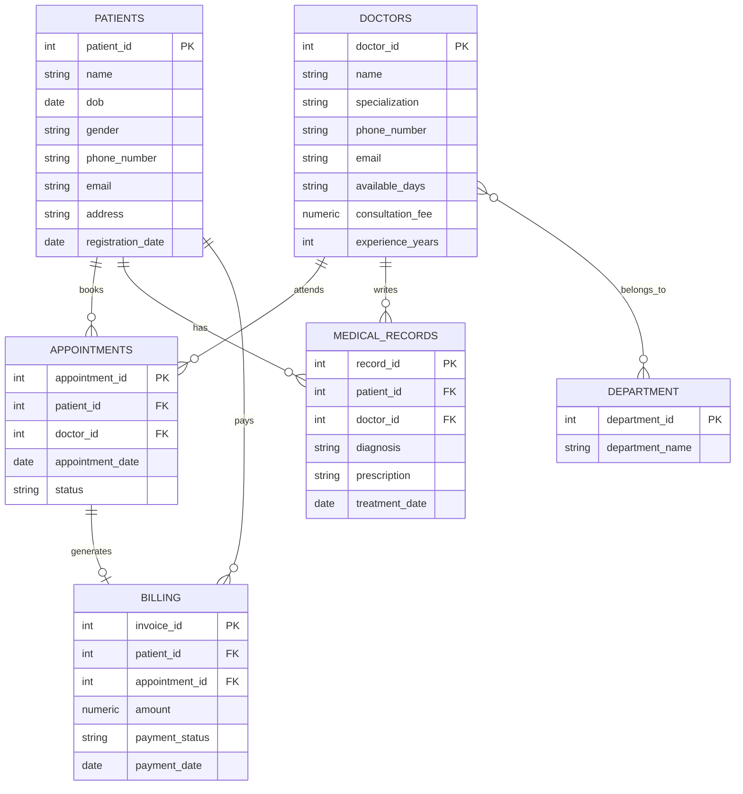

# HOSPITAL-MANAGEMENT-SYSTEM
<div align="center">


<br/>


</div>

---

## 🏥 About the Project

**Hospital Management System** is a relational database project built in **PostgreSQL** that models the core operations of a hospital — patient registration, doctor management, appointment scheduling, medical records, billing, and department mapping.

It's designed as a hands-on SQL practice project covering everything from **table design & constraints** to **joins, subqueries, window functions, and aggregate reporting**.

---

## ✨ Features

- 🧑‍⚕️ **Patient Management** — registration, contact details, and history tracking
- 👨‍⚕️ **Doctor Directory** — specialization, fees, experience, and availability
- 📅 **Appointment Scheduling** — status tracking (Scheduled / Completed / Cancelled)
- 📋 **Medical Records** — diagnosis & prescription history per patient
- 💰 **Billing System** — invoices, payment status, and revenue reports
- 🏢 **Department Mapping** — many-to-many doctor–department relationships
- 📊 **Analytics Queries** — top-paying patients, top-performing doctors, monthly revenue trends, risk classification with `CASE`, running totals with `OVER()`, and more

---

## 🗂️ Database Schema (ER Overview)



---

## 🧩 Tech Stack

| Layer | Technology |
|---|---|
| Database Engine | PostgreSQL |
| Query Language | SQL (DDL, DML, DQL) |
| Concepts Used | Joins, Subqueries, Aggregates, Window Functions, `CASE`, `DATE_TRUNC`, `COALESCE` |

---

## 📁 Project Structure

```
📦 hospital-management-system
 ┣ 📜 hospital_management_system.sql   # Full schema + data + queries
 ┗ 📜 README.md                        # You are here
```

---

## 🚀 How to Run

1. Install **PostgreSQL** and open `psql` or **pgAdmin**
2. Create the database:
   ```sql
   CREATE DATABASE hospital_management;
   ```
3. Run the script:
   ```bash
   psql -U your_username -d hospital_management -f hospital_management_system.sql
   ```
4. Explore the tables and run the sample analytics queries included in the file 🎉

---

## 📊 Sample Query Highlights

```sql
-- Top 5 patients by total amount paid
SELECT patient_id, SUM(amount) AS total_paid
FROM Billing
WHERE payment_status = 'Paid'
GROUP BY patient_id
ORDER BY total_paid DESC
LIMIT 5;

-- Department-wise revenue
SELECT d.department_name, SUM(b.amount) AS total_revenue
FROM Billing b
JOIN Appointmentss a ON b.appointment_id = a.appointment_id
JOIN Doctor_Department dd ON a.doctor_id = dd.doctor_id
JOIN Department d ON dd.department_id = d.department_id
WHERE b.payment_status = 'Paid'
GROUP BY d.department_name;

-- Doctor experience classification
SELECT name,
CASE
    WHEN experience_years > 15 THEN 'Senior'
    WHEN experience_years >= 5 THEN 'Mid-Level'
    ELSE 'Junior'
END AS seniority
FROM doctorss;
```

---
## SAMPLE OUTPUT


## 🗺️ Tables Overview

| Table | Purpose |
|---|---|
| `patientsss` | Patient personal & contact details |
| `doctorss` | Doctor profiles, fees & specialization |
| `appointmentss` | Links patients ↔ doctors with date & status |
| `medical_recordss` | Diagnosis & prescription history |
| `billing` | Invoices & payment tracking |
| `department` | List of hospital departments |
| `doctor_department` | Many-to-many doctor–department mapping |

---

## 👩‍💻 Author

**Kavita Khushalani**

<div align="center">

⭐ If you found this project useful, consider giving it a star!

</div>
